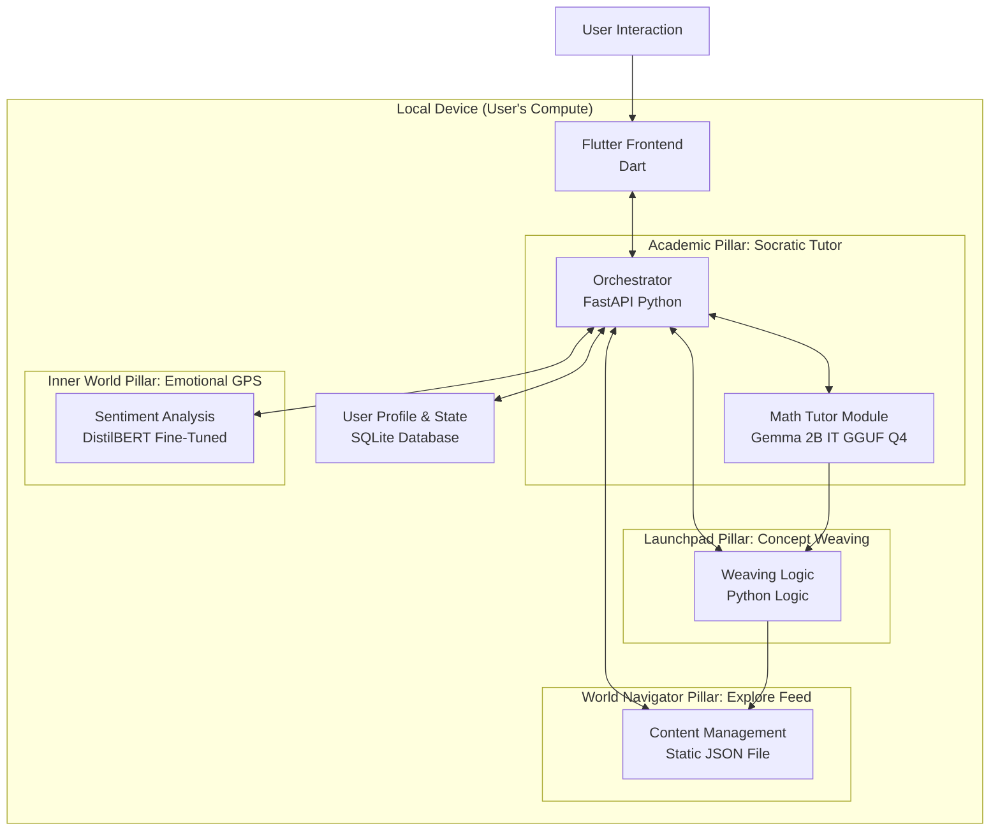

# Guiding Principles for the MVP Build

---

## Core Principles

- **Ruthless Prioritization**  
  The MVP will deliver the essence of each pillar through **one core feature**, not the entire feature set.

- **Modularity First**  
  Each component will be built as an independent, replaceable service.  
  This allows for parallel development and future upgrades.

- **Open-Source Excellence**  
  We will use the best, most efficient **permissively-licensed models** available.

- **The User's Machine is Our Datacenter**  
  All components must be optimized to run on a modern laptop (16GB RAM).  
  Techniques: quantization + efficient inference libraries.

---

## MVP Scope: The Minimum Viable Pillars

We will build **one defining feature** for each pillar to create a cohesive and demonstrable experience:

- **Pillar 1 (Academic Compass):** Socratic Tutor for *10th-grade Mathematics (Algebra)*.  
- **Pillar 2 (Inner World):** Emotional GPS via text-based daily check-in.  
- **Pillar 3 (World Navigator):** Manual *Explore Feed* (curated 5–10 content items).  
- **Pillar 4 (Launchpad):** Integrated *Concept Weaving* – the "magic glue" connecting learned concepts to the Explore Feed.  

🚫 **Not included in MVP**: Voice I/O, Knowledge Graph, Adaptive Map UI, Mentor Marketplace, Automated Recommender Systems (planned for **V2**).

---

## MVP Architecture & Technology Stack

The MVP is designed to run fully **on-device**, leveraging lightweight, optimized components.

### Diagram

# MVP Build Plan

## Component Breakdown & Justification

| Component        | Technology                     | Justification & Implementation |
|------------------|--------------------------------|--------------------------------|
| **Frontend Client** | Flutter | Cross-platform (Android, iOS, Desktop). Rich UI for maps & feeds. Uses `http` package to call Orchestrator. |
| **Orchestrator** | FastAPI (Python) | Lightweight, async, integrates ML models easily. Exposes REST API for frontend. |
| **Local Data** | SQLite | Simple, file-based storage for profile, chat history, emotional check-ins. No server required. |
| **Socratic Tutor** | Gemma 2B Instruct (Quantized GGUF Q4) | 7B too heavy for CPU-only devices. Gemma 2B balances quality + efficiency. Uses `llama.cpp` or `ollama pull gemma:2b`. |
| **Emotional GPS** | Fine-tuned DistilBERT | Small (~250MB), fast, accurate for sentiment classification. Trained on datasets like GoEmotions. |
| **Explore Feed** | Static JSON File | MVP avoids CMS complexity. Manually curated content (URL, title, description, tags). Orchestrator reads JSON. |
| **Concept Weaving** | Python Logic | No model needed. Pattern matching: when a concept is mastered, suggest Explore Feed items tagged with it. |

---

## The Build Plan: A 6-Week Sprint

### Week 1–2: Foundation & Core Services
- Create Flutter app skeleton with chat interface.
- Build FastAPI orchestrator with endpoints (`/chat`, `/checkin`).
- Integrate Ollama + Gemma 2B model for inference.
- Add fine-tuned DistilBERT for sentiment analysis.

### Week 3–4: Pillar Integration
- **Pillar 1:** Connect Socratic tutor to `/chat` endpoint.  
- **Pillar 2:** Build emotional check-in screen → connect to sentiment endpoint → log to SQLite.  
- **Pillar 3:** Build JSON structure for Explore Feed + simple UI.  
- **Pillar 4:** Implement `concept_weaver.py` script (tag matching).  

### Week 5: The "Magic" Glue
- Modify `/chat`: after tutoring, call `concept_weaver.py`.  
- Return Explore Feed suggestions to frontend alongside tutor’s response.  
- UI Example:  
  > “You mastered Linear Equations! Check how SpaceX uses them to land rockets: [Link]”.  
- Implement user state management in SQLite (`has_seen_linear_equations` flag).  

### Week 6: Testing & Refinement
- End-to-end testing with target users.  
- Performance profiling (goal: sub-5s responses).  
- UI polish, bug fixes, and packaging for desktop.  

---

## Risks & Mitigations

- **Risk:** Gemma 2B too weak for tutoring.  
  **Mitigation:** Use Mistral 7B baseline. Offer larger quantization (Q3) or "High Quality" mode on stronger hardware.  

- **Risk:** Static JSON Explore Feed feels limited.  
  **Mitigation:** MVP validates the connection, not scalability. V2 → simple CMS.  

- **Risk:** App feels like two separate tools.  
  **Mitigation:** Ensure Concept Weaving is seamless, polished, and delightful.  

---

## Conclusion
This plan leverages **open-source excellence** in a realistic **6-week timeframe**, proving the core innovation:  
➡️ **An adaptive, holistic feedback loop running entirely on the user’s device.**
