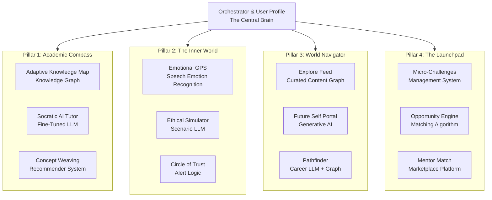

# From Blueprint to Build: Architecting Project Udaan

The core philosophy remains: a modular, multi-model system where the best open-source model handles each specific task, all orchestrated into a seamless experience.

---

## Technical Architecture Mapped to the Four Pillars

# The AI Architecture: Powering the Four Pillars

---

## The Central Brain: The Orchestrator & User Profile

- **Maintains a Dynamic User Profile**  
  A living document of academic mastery, emotional check-in history, interests, goals, and activity completions.

- **Sequences Interactions**  
  Decides which models and pipelines to invoke based on the user's action  
  (e.g., a math question → Academic Compass pillar; an emotional check-in → Inner World pillar).

---

## The "Concept Weaving" Engine

The Socratic Tutor detects concept mastery → pings Orchestrator → Orchestrator checks user’s profile → pings **World Navigator** to recommend relevant content  
(e.g., an ISRO video for a physics concept).

---

## Pillar 1: The Academic Compass - Technical Spec

- **Socratic AI Tutor**  
  Fine-tuned Gemma/Mistral 7B model.  
  **Prompt:**  
  > "You are a Socratic tutor. Never give direct answers. Ask guiding questions based on the user's known mastery level of [concept].  
  > Use an analogy related to [user's interest from their profile]."

- **Adaptive Knowledge Map**  
  Structured Knowledge Graph of syllabus (e.g., *Algebra I → Linear Equations → Slope*).  
  Each node is linked to materials, mastery score updated by performance.

- **Concept Weaving**  
  Managed by the Orchestrator.

---

## Pillar 2: The Inner World - Technical Spec

- **Emotional GPS**  
  - *Text Input*: Fine-tuned sentiment model (DistilBERT).  
  - *Voice Input*: Speech Emotion Recognition (HuBERT/Wav2Vec2). Runs locally for privacy.  

- **Ethical Simulator**  
  - Gemma/Mistral LLM, fine-tuned on dilemmas.  
  - **System prompt:**  
    > "You are a wisdom coach. Present a nuanced dilemma and offer multiple paths.  
    > Explain the potential consequences of each, focusing on character and community impact."

---

## Pillar 3: The World Navigator - Technical Spec

- **Explore Feed**: Hybrid recommender system.  
  - Collaborative filtering: *“Users like you liked this…”*  
  - Content-based filtering: *“Because you watched SpaceX → here’s Rocket Engineering…”*  
  - Human-in-the-loop validation for quality control.  

- **Future Self Portal & Pathfinder**: Generative AI feature.  
  **Prompt:**  
  > "Generate an immersive, first-person narrative of a day in the life of a [career].  
  > Weave in how skills from [user’s academic strengths] and values from [user’s profile] are used.  
  > Output in engaging, storyteller voice."

---

## Pillar 4: The Launchpad - Technical Spec

- **Opportunity Engine**  
  Rules-based matching algorithm.  
  Example:
  
- **Micro-Challenges & Mentor Match**  
Platform features leveraging profile data.

---

## The Path Forward: Phased Execution

### Phase 1: The "Manual Udaan" Validation (Next 4 Weeks)
- **Goal**: Validate every pillar manually with siblings.  
- **Process**:  
- Academic: Use Socratic method, real-world analogies.  
- Inner World: Ethical dilemma discussions.  
- World Navigator: Share 90-second future trend videos.  
- Launchpad: Find one scholarship or contest.  
- **Output**: *Validation Journal* → becomes product requirements document.  

---

### Phase 2: The Modular MVP (8–10 Weeks)
- **Tech Stack**: Ollama (LLMs), Whisper.cpp (SER), FastAPI (Orchestrator), Flutter (App).  
- **MVP Components**:  
- Pillar 1: Socratic Tutor for one subject.  
- Pillar 2: Emotional GPS (text-based).  
- Pillar 3: Manually curated Explore Feed.  
- Orchestrator: Suggests *“Explore”* item after tutoring session.  

---

### Phase 3: Expansion & Refinement (Post-MVP)
- Voice + SER integration (Pillar 2).  
- Build Knowledge Graph (Pillar 1).  
- Develop Generative AI features (Pillar 3).  
- Open platform for mentors & challenge creation (Pillar 4).  

