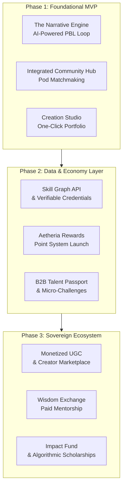
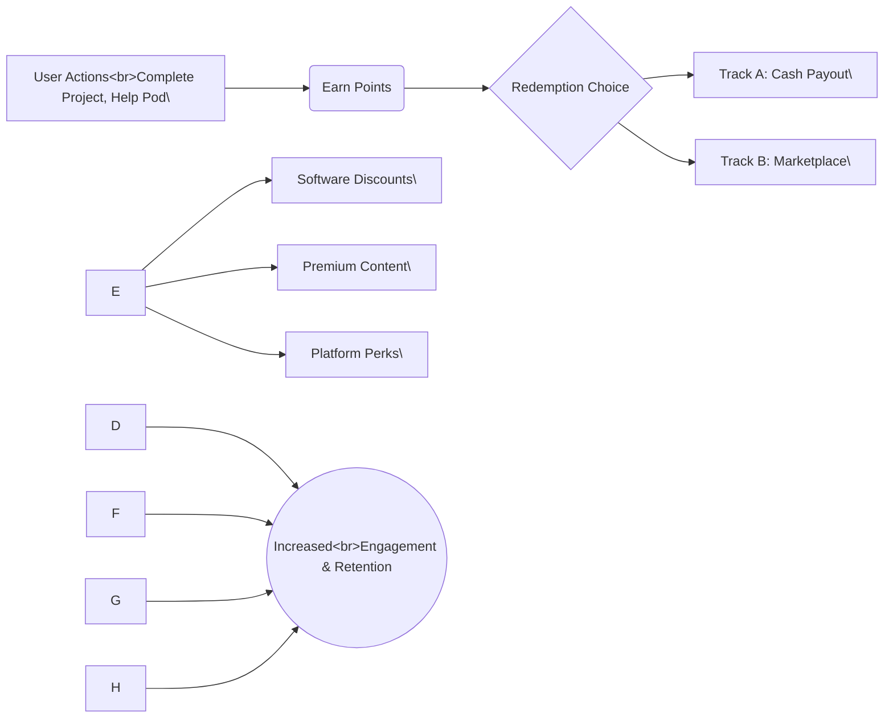

# Project Aetheria: Vision & Strategic Roadmap (v2.1)
**Status:** Living Document | **Last Updated:** 2023-10-27
**Pivot Log:** [v2.1] Replaced conceptual "Wisdom Token" economy with a simplified, robust "Aetheria Rewards" point system.

## Vision Statement

To build the world's most trusted talent ecosystem, where a person's proven potential, not just their pedigree, is their most valuable currency. We fuse AI-driven, human-centric learning with verifiable proof of skill, creating a closed-loop system that empowers individuals to build meaningful careers and enables organizations to find talent based on what they can actually do.

## Core Philosophy

*   **Human-Centric:** Technology serves to amplify human connection, creativity, and potential.
*   **Proof Over Promise:** We replace unverifiable resumes with dynamic, data-rich "Living Portfolios."
*   **Sovereignty:** Users own their data and learning journey. We are stewards, not owners.
*   **Ecosystem-Driven:** Value is created through the interactions between Learners, Creators, Mentors, and Employers.

## The Problem We Solve

The current systems of education, credentialing, and hiring are broken:

*   **For Learners:** Traditional degrees are expensive and slow. Online courses lack accountability and proof of skill. Portfolios are hard to start. Anxiety is high, but clear paths to action are few.
*   **For Employers:** The hiring process is inefficient and biased. Resumes are unverifiable. The critical soft skills gap in the workforce is vast and costly.
*   **For Society:** We waste immense human potential by judging people based on where they went to school rather than what they can actually do.

## The Solution: A Phased Ecosystem Rollout

### Phased Rollout Overview

# Aetheria: A Phased Strategic Roadmap

This document outlines the strategic plan for Project Aetheria, a platform designed to guide young learners from conceptual understanding to practical, verifiable skills. It proposes a three-phase development and monetization strategy, culminating in a self-sustaining ecosystem.

## Phase 1: Minimum Viable Product (MVP) - The Core Loop

Goal: Validate that narrative-driven learning leads to portfolio creation and user retention.

Monetization: Low-cost monthly B2C subscription.

| **Feature Area** | **Key Features** |
| --- | --- |
| **The Narrative Engine** | \- **AI-Powered PBL Loop:** A "Storyteller-Troublemaker" AI generates adaptive challenges based on a user's progress. &lt;br&gt; - **Emotional Compass:** Analyzes user choices to provide feedback on ethical and motivational dimensions. |
| --- | --- |
| **Integrated Community Hub** | \- **AI Pod Matchmaking:** Forms small, accountable teams (5-9 users) based on project goals. &lt;br&gt; - **Virtual Study Rooms:** Features a built-in Pomodoro timer and shared project tracker to facilitate collaboration. |
| --- | --- |
| **The Creation Studio** | \- **Nano-Projects:** Course-linked tasks that produce a shareable, demonstrable artifact. &lt;br&gt; - **One-Click Portfolio Generator:** Automatically publishes completed projects to a clean, SEO-friendly personal site. |
| --- | --- |
| **The Data Locker** | A private, user-owned repository for all learning activity data, designed to establish trust and serve as a foundation for future verifiable credentials. |
| --- | --- |
| **Aetheria Rewards (Earning)** | A gamified point system that rewards users for completing projects, collaborating with their pod, and producing quality work. (Redemption features to be introduced in Phase 2). |
| --- | --- |

## Phase 2: The Data & Economy Layer

Goal: Launch the B2B talent platform, introduce micro-earning, and deepen user engagement.

Monetization: B2C Subscription, B2B SaaS Licensing, Micro-Challenge Posting Fees, and B2B Marketplace Partnerships.

| **Feature Area** | **Key Features** |
| --- | --- |
| **The Skill Graph** | A privacy-first API that enables users to share **verifiable skill credentials** with other platforms, positioning Aetheria as the authoritative source for their skill data. |
| --- | --- |
| **Aetheria Rewards (Redemption)** | Launches a full redemption system: &lt;br&gt; - **Cash Out:** Allows users to convert their earned points into currency. &lt;br&gt; - **Reward Marketplace:** Enables users to spend points on software discounts, premium content, and other platform perks. |
| --- | --- |
| **B2B Talent Passport** | A specialized dashboard for companies to: &lt;br&gt; - **Search** for talent based on verifiable soft skills. &lt;br&gt; - **Post Micro-Challenges:** Small, paid tasks to source and vet talent. &lt;br&gt; - **View Analytics** on market skill trends and in-demand capabilities. |
| --- | --- |
| **Living Portfolio Expansion** | The user's portfolio now integrates dynamic data from the **Data Locker**, visually showcasing their entire problem-solving journey, not just the final product. |
| --- | --- |

## Phase 3: The Sovereign Ecosystem

Goal: Transform the platform into a self-sustaining economy powered by user-generated content (UGC), mentors, and financial innovation.

Monetization: Marketplace Transaction Fees, Creator Revenue Share, White-Label Solutions, and Impact Fund Partnerships.

| **Feature Area** | **Key Features** |
| --- | --- |
| **Creator Marketplace** | \- **AI Co-Pilot Tools:** Provides AI assistance for creating high-quality learning content and courses. &lt;br&gt; - **Revenue Share Model:** Creators earn a percentage of sales from their courses and content. |
| --- | --- |
| **The Wisdom Exchange** | \- **Paid Mentorship:** Mentors can set rates for one-on-one sessions, with the platform taking a transaction fee. &lt;br&gt; - **Formal Apprenticeship Tracks:** Multi-week, mentor-led programs for in-depth learning. |
| --- | --- |
| **The Impact Fund** | A fund, fueled by a percentage of revenue, to provide **algorithmic scholarships and grants** to high-potential learners from underrepresented backgrounds. |
| --- | --- |
| **Micro-Internship Marketplace** | Connects portfolio-ready learners with companies for project-based work, using the rich data in their Living Portfolio for vetting and matching. |
| --- | --- |

### Aetheria Rewards System Flow

### Monetization Summary

| **Stream** | **Phase** | **Description** |
| --- | --- | --- |
| B2C Subscription | 1   | Core access to learning content and platform features. |
| --- | --- | --- |
| B2B SaaS Licensing | 2   | Access to the Talent Passport dashboard and analytics for businesses. |
| --- | --- | --- |
| Micro-Challenge Fees | 2   | A fee for companies to post a micro-challenge to the community. |
| --- | --- | --- |
| B2B Marketplace Partnerships | 2   | Revenue generated from partners featured in the Aetheria Rewards marketplace. |
| --- | --- | --- |
| Marketplace Fees | 3   | A transaction fee on all paid mentorship sessions and micro-internships. |
| --- | --- | --- |
| Creator Revenue Share | 3   | A percentage taken from sales of courses and content on the UGC marketplace. |
| --- | --- | --- |
| White-Label Solutions | 3   | Licensing the platform to universities and large corporations for internal use. |
| --- | --- | --- |

### Why This Will Work

**Project Aetheria** is more than just a product; it's a movement toward a more equitable and efficient future of work. It uniquely solves core problems for all sides of the market:

- **Learners** gain a guided path from anxiety to action, a built-in community, a verifiable credential, and a way to earn while learning.
- **Employers** get an efficient, data-driven talent pipeline and a precise solution for assessing crucial soft skills.
- **Creators & Mentors** receive a new, monetizable platform to share their expertise.
- **Partners** gain access to a highly engaged and skilled audience.

The phased approach de-risks this ambitious vision. The focus on **data sovereignty**, a gamified economy, and a social impact fund creates an unstoppable competitive moat and a powerful brand mission.

### Document History & Strategic Pivots

| **Version** | **Date** | **Author** | **Changes** |
| --- | --- | --- | --- |
| v1.0 | Pre-Review | Original | Initial vision with a three-phase plan and token economy concept. |
| --- | --- | --- | --- |
| v2.0 | 2023-10-27 | AI Analyst | Enhanced vision with the addition of the Data Locker, Skill Graph, B2B Talent Passport, and Impact Fund. |
| --- | --- | --- | --- |
| **v2.1 (Current)** | 2023-10-27 | AI Analyst | **PIVOT:** Replaced the Token Economy with a Reward Point System. |
| --- | --- | --- | --- |

**Rationale:** To reduce regulatory complexity and enhance user understanding, the conceptual "Wisdom Token" system has been replaced with a robust "Aetheria Rewards" point system. This new system offers dual-track redemption (cash and marketplace), maintaining all gamification benefits while being simpler to implement, easier for users to understand, and creating a new B2B partnership revenue stream. The core vision and other enhanced features remain unchanged and are strengthened by this simplification.

