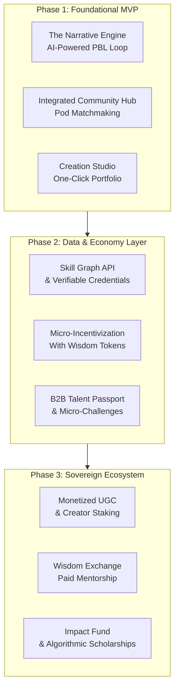

# Project Aetheria: Vision & Strategic Roadmap

## Vision Statement

To build the world's most trusted talent ecosystem, where a person's proven potential, not just their pedigree, is their most valuable currency. We fuse AI-driven, human-centric learning with verifiable proof of skill, creating a closed-loop system that empowers individuals to build meaningful careers and enables organizations to find talent based on what they can actually do.

## Core Philosophy

*   **Human-Centric:** Technology serves to amplify human connection, creativity, and potential.
*   **Proof Over Promise:** We replace unverifiable resumes with dynamic, data-rich "Living Portfolios."
*   **Sovereignty:** Users own their data and learning journey. We are stewards, not owners.
*   **Ecosystem-Driven:** Value is created through the interactions between Learners, Creators, Mentors, and Employers.

## The Problem We Solve

The current systems of education, credentialing, and hiring are broken:

*   **For Learners:** Traditional degrees are expensive and slow. Online courses lack accountability and proof of skill. Portfolios are hard to start. Anxiety is high, but clear paths to action are few.
*   **For Employers:** The hiring process is inefficient and biased. Resumes are unverifiable. The critical soft skills gap in the workforce is vast and costly.
*   **For Society:** We waste immense human potential by judging people based on where they went to school rather than what they can actually do.

## The Solution: A Phased Ecosystem Rollout

### Phase 1: Minimum Viable Product (MVP) - The Core Loop
**Goal:** Validate that narrative-driven learning leads to portfolio creation and user retention.
**Monetization:** Low-cost monthly B2C subscription.

| Feature Area | Key Features |
| :--- | :--- |
| **The Narrative Engine** | - **AI-Powered PBL Loop:** "Storyteller-Troublemaker" AI generates adaptive challenges. - **Emotional Compass:** Analyzes choices for ethical/motivational feedback. |
| **Integrated Community Hub** | - **AI Pod Matchmaking:** Forms small, accountable teams (5-9 users). - **Virtual Study Rooms:** With Pomodoro timer & shared project tracker. |
| **The Creation Studio** | - **Nano-Projects:** Course-linked tasks that create a shareable artifact. - **One-Click Portfolio Generator:** Auto-publishes projects to a clean, SEO-friendly site. |
| **The Data Locker (New)** | A private, user-owned repository for all learning activity data, establishing trust and setting the stage for future verifiable credentials. |

### Phase 2: The Data & Economy Layer
**Goal:** Launch the B2B talent platform, introduce micro-earning, and deepen engagement.
**Monetization:** B2C Subscription, **B2B SaaS Licensing**, **Micro-Challenge Posting Fees**.

| Feature Area | Key Features |
| :--- | :--- |
| **The Skill Graph (New)** | A privacy-first API that lets users share **verifiable skill credentials** with other platforms, making Aetheria the source of truth for their skills. |
| **Micro-Incentivization (New)**| Introduce **"Wisdom Tokens"** awarded for completion, helping others, and quality work. Tokens can be used for premium content, discounts, or cashed out. |
| **B2B Talent Passport (New)** | A dashboard for companies to: - **Search** for talent by verifiable soft skills. - **Post Micro-Challenges:** Small, paid tasks to source and vet talent. - **View Analytics** on market skill trends. |
| **Living Portfolio Expansion** | The portfolio now integrates data from the **Data Locker**, visually showcasing the user's problem-solving journey. |

### Phase 3: The Sovereign Ecosystem
**Goal:** Become a self-sustaining economy powered by UGC, mentors, and financial innovation.
**Monetization:** **Marketplace Transaction Fees**, **Creator Staking Fees**, **White-Label Solutions**, **Impact Fund Partnerships**.

| Feature Area | Key Features |
| :--- | :--- |
| **Creator Marketplace** | - **AI Co-Pilot Tools** for creating quality content. - **Staking Model:** Creators stake tokens to publish; rewarded for high ratings, penalized for low quality. |
| **The Wisdom Exchange (New)**| - **Paid Mentorship:** Mentors set rates for sessions; platform takes a fee. - **Formal Apprenticeship Tracks:** Multi-week, mentor-led programs. |
| **The Impact Fund (New)** | A fund fueled by revenue to provide **algorithmic scholarships and grants** to high-potential learners from underrepresented backgrounds. |
| **Micro-Internship Marketplace** | Connects portfolio-ready learners with companies for project-based work, vetted by the rich data in their Living Portfolio. |

## Monetization Summary

| Stream | Phase | Description |
| :--- | :--- | :--- |
| **B2C Subscription** | 1 | Core access to content and features. |
| **B2B SaaS Licensing** | 2 | Access to the Talent Passport dashboard and analytics. |
| **Micro-Challenge Fees** | 2 | Fee for companies to post a challenge to the community. |
| **Marketplace Fees** | 3 | Transaction fee on mentorship sessions and micro-internships. |
| **Creator Fees/Staking** | 3 | Revenue share from course sales and fees from the staking model. |
| **White-Label Solutions** | 3 | Licensing the platform to universities and large corporations. |
| **Data API Access** | 3 | (Optional) Paid API for skill verification (with user consent). |

## Why This Will Work

**Project Aetheria** is more than a product; it's a movement towards a more equitable and efficient future of work. It uniquely solves core problems for all sides of the market:
*   **Learners** get a guided path from anxiety to action, a built-in community, and a verifiable credential.
*   **Employers** get an efficient, data-driven talent pipeline and a solution for assessing crucial soft skills.
*   **Creators & Mentors** get a new, monetizable platform to share their expertise.

The phased approach de-risks the ambitious vision. The enhanced focus on **data sovereignty, a tokenized economy, and a social impact fund** creates an unstoppable competitive moat and a powerful brand mission.
